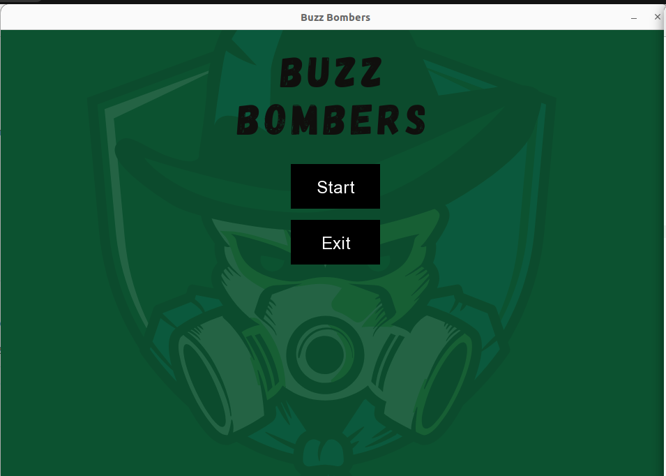
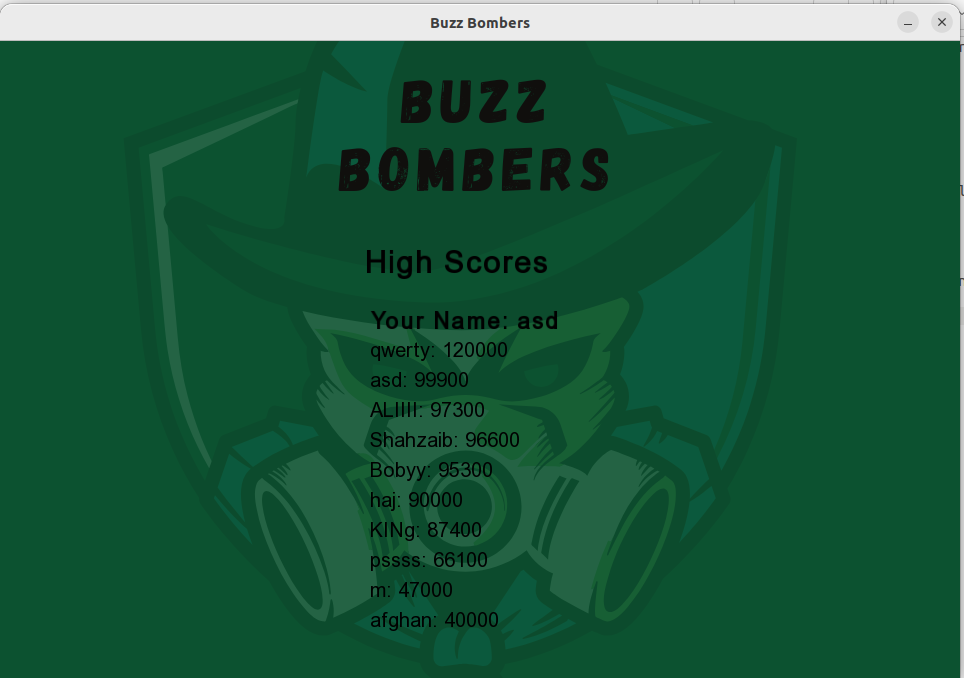

# 🐝 Buzz Bombers — SFML Game

A simple 2D arcade shooting game made in C++ using the SFML library.  
This project is inspired by the classic Buzz Bombers game and includes multiple levels, enemy bees, sound effects, textures, score tracking, and menu screens.

---

## 📸 Screenshots

### Main Menu


### Level Selection


### Gameplay


### High Scores


---

## 🎮 Features

- Multiple game levels
- Worker bees and killer bees
- Score system
- Sound effects and music
- Main menu and level selection
- Textures and sprites using SFML
- Shooting mechanics
- Simple enemy movement AI

---

## 🛠️ Technologies Used

- C++
- SFML Library
- Object Oriented Programming
- g++

---

## 🚀 How to Run

### Install Requirements

```bash
sudo apt-get install g++
sudo apt-get install libsfml-dev
