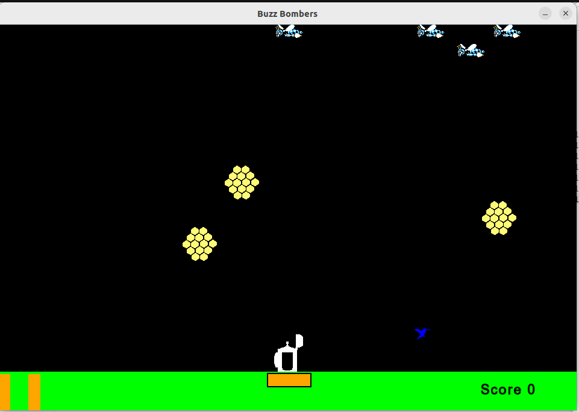
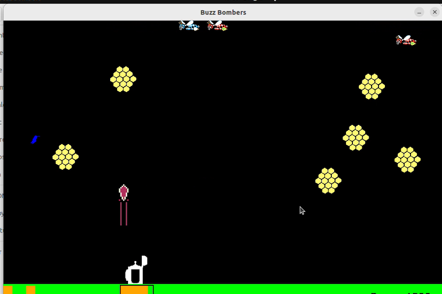

# 🐝 Buzz Bombers — SFML Game

A simple 2D arcade shooting game made in C++ using the SFML library.  
This project is inspired by the classic Buzz Bombers game and includes multiple levels, enemy bees, score tracking, sound effects, and menu screens.

---

## 📸 Screenshots

### Main Menu


### Level Selection


### Gameplay — Level 1


### Gameplay — Level 2


### Leaderboard


---

## 🎮 Features

- Multiple levels
- Enemy bee movement
- Score system
- Sound effects and music
- Main menu and level selection
- Shooting mechanics
- Simple enemy AI
- Textures and sprites using SFML

---

## 🛠️ Technologies Used

- C++
- SFML Library
- Object Oriented Programming
- GNU G++

---

# 🚀 Complete Setup, Compilation and Running Guide

## Step 1 — Open Ubuntu Terminal

Open terminal in Ubuntu/Linux.

---

## Step 2 — Install GNU G++ Compiler

Run this command:

```bash id="jph2qk"
sudo apt-get install g++
